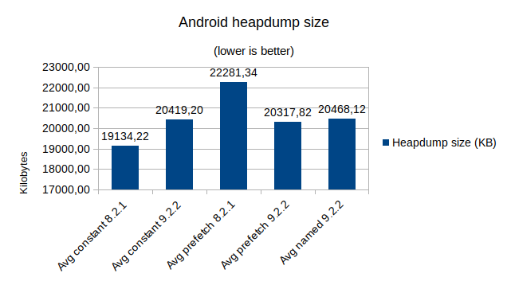
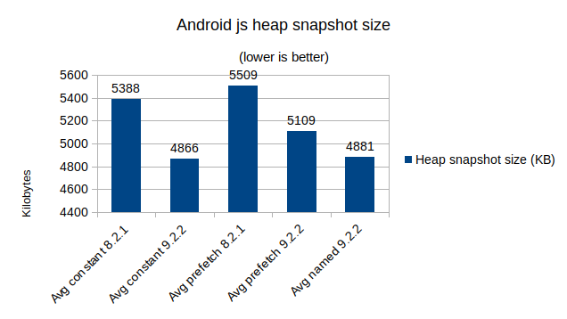

# Results

* `prefetch 8.2.1` - stats for the application compiled with SDK 8.2.1 and `colors-with-fetch.js`
* `prefetch 9.2.2` - SDK 9.2.2 and `colors-with-fetch.js`
* `named 9.2.2` - SDK 9.2.2 and `colors-only-name.js`

Note: named color were added in [TIMOB-27895](https://jira.appcelerator.org/browse/TIMOB-27895) (SDK 9.1.0)

## Load Time

 
Click to open

* `parse`:
  * Read `semantics.colors.json`
  * parse it
  * fetch each color with `Ti.UI.fetchSemanticColor`
* `create`: `Ti.UI.create*`
* `layout`: first `postlayout` event on the window

## Memory

### Android. Java Heap Dump File Size.

 
Click to open

Collected with command:
* `adb shell 'am dumpheap PID /data/local/tmp/dump.hprof'`

Note: in SDK 8.2.1 for Android `Ti.UI.fetchSemanticColor` returns `string` value; in 9.2.2 - ColorProxy (?)

### iOS. Native heap size

 
Click to open

`All Heap & Anonymous VM` `Total Bytes` after 50 seconds uptime.

### JavaScript heap snapshot size.

 
Click to open

 
Value reported in `Statistics` as **`Total`** for a heap snapshot. 

Size of an exported heap snapshot (not the actual heap size!).

