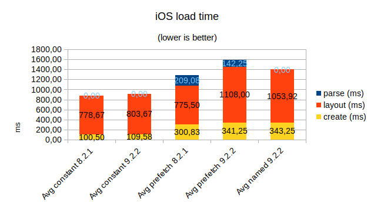

# Results

## Time

* `parse`:
  * Read `semantics.colors.json`
  * parse it
  * fetch each color with `Ti.UI.fetchSemanticColor`
* `create`: `Ti.UI.create*`
* `layout`: first `postlayout` event on the window

